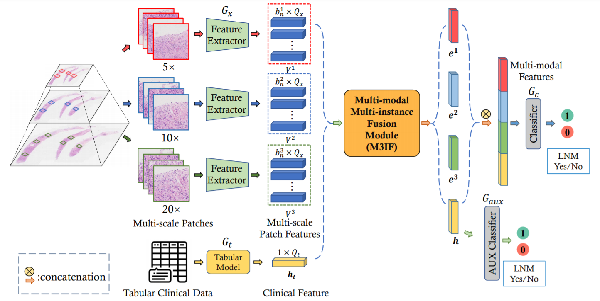

# MMMI


This repository is an official PyTorch implementation of the paper 
**"Multi-modal Multi-instance Learning using Weakly Correlated Histopathological Images and Tabular Clinical Information"** [paper](https://link.springer.com/chapter/10.1007/978-3-030-87237-3_51) 
from **MICCAI 2021**.



## Citation
```bibtex
@inproceedings{li2021multi,
  title={Multi-modal Multi-instance Learning Using Weakly Correlated Histopathological Images and Tabular Clinical Information},
  author={Li, Hang and Yang, Fan and Xing, Xiaohan and Zhao, Yu and Zhang, Jun and Liu, Yueping and Han, Mengxue and Huang, Junzhou and Wang, Liansheng and Yao, Jianhua},
  booktitle={International Conference on Medical Image Computing and Computer-Assisted Intervention},
  pages={529--539},
  year={2021},
  organization={Springer}
}
```
## Installation
### Dependencies
* Python 3.6
* PyTorch >= 1.5.0
* einops
* numpy
* scipy
* sklearn
* openslide
* albumentations
* opencv
* efficientnet_pytorch
* yacs

## Usage

### Evaluation
```shell script
python3 -m torch.distributed.launch \
        --nproc_per_node 4 \
        --master_port=XXXX \
        dist_train_modal_fusion.py \
        --cfg configs/test.yaml \

```
XXXX denotes your master port


### Note for data
 
We provide sample data for testing the pipeline, but they are not real data used in the experiments.

The dataset used in this research is private.

You can refer the code in `preprocessing/extract_feat_with_tta.py` to process your own data.

#### 1. Offline-feature extraction

The features are extracted using EfficientNet-b0.
The file is saved in the format:

```
{
    'tr': np.ndarray, shape(n, 1280)
    'val': np.ndarray, shape(n, 1280)
}
```

#### 2. Combine feature files
Combine the features of all Patches within each WSI into a single file to reduce the IO overhead during training.

```bash
python3 preprocessing/merge_patch_feat.py
```

## Disclaimer

This tool is for research purpose and not approved for clinical use.

This is not an official Tencent product.